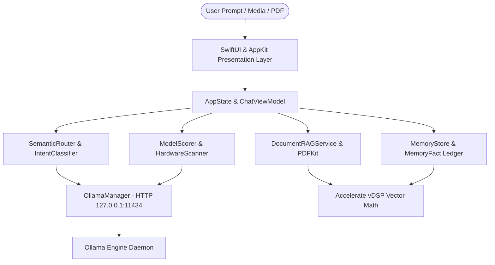

# NativAI — macOS System Architecture

## 1. System Overview

**NativAI** is a high-performance, privacy-first desktop application engineered specifically for macOS (macOS 14.0 Sonoma and newer). It orchestrates, routes, and executes local Large Language Models (LLMs), Vision models, and Embedding models entirely on the user's Mac.



### Privacy & Network Boundaries
NativAI enforces strict network isolation for core operations:
* **100% On-Device / Zero Network**: Text chat inference, document parsing/RAG, memory vector search, and voice dictation (`SFSpeechRecognizer` with `requiresOnDeviceRecognition = true`) execute entirely on local hardware with zero cloud telemetry.
* **Controlled Network Egress**:
  * **Engine Installer**: Downloads the official Ollama macOS package from `ollama.com` if not already installed.
  * **Web Search**: Queries DuckDuckGo HTML / `wttr.in` only when the user explicitly triggers real-time search.
  * **Image Generation**: Generates images via `image.pollinations.ai` (badged as "Pollinations AI") with an offline aesthetic canvas fallback (badged as "Offline Canvas").

---

## 2. Directory Layout & Module Structure

The project is structured as a Swift Package Manager (SPM) universal application target with dedicated domain layers:

```
Sources/NativAI/
├── Models/                             # Core Data Models
│   ├── DeviceSpecs.swift               # Hardware tier & dynamic context window calculation
│   ├── ModelEntry.swift                # Catalog model entry & compatibility representation
│   ├── ModelCapabilities.swift         # Probed model capabilities (vision, tools, thinking)
│   ├── DisplayMessage.swift            # Chat message entity & transcript serialization
│   ├── MessageAttachment.swift         # Typed attachments (images, text/code files)
│   ├── SessionArtifact.swift           # Multi-modal artifact ledger & ordinal references
│   ├── ChatSession.swift               # Session persistence & auto-title lifecycle
│   └── MemoryFact.swift                # Normalized cross-session preference/fact ledger
│
├── Services/                           # Core Engine Services
│   ├── OllamaManager.swift             # Process supervisor & REST API client (127.0.0.1:11434)
│   ├── HardwareScanner.swift           # Metal & IOKit RAM/VRAM profiler
│   ├── SemanticRouter.swift            # Fast-path pattern matching & intent classification
│   ├── ModelScorer.swift               # RAM tier scoring with model stickiness
│   ├── CapabilityProbe.swift           # Dynamic /api/show capability discovery
│   ├── DocumentRAGService.swift        # In-memory document chunking & retrieval
│   ├── EmbeddingService.swift          # Accelerate framework (vDSP) SIMD vector dot product
│   ├── MemoryStore.swift               # Persistent long-term memory store
│   ├── ConversationDigest.swift        # Token-aware monotonic compaction for long chats
│   ├── TokenBudget.swift               # Dynamic context window allocator
│   ├── IntentClassifier.swift          # Domain classifier (.general, .coding, .vision, .image)
│   ├── DynamicCatalogDiscoveryService.swift # Curated hardware compatibility evaluator
│   ├── AudioTranscriptionService.swift# On-device Speech-to-Text via Speech framework
│   ├── WebSearchService.swift          # DuckDuckGo HTML scraper & weather lookups
│   └── PerformanceMonitor.swift        # Real-time token generation throughput tracker
│
├── Views/                              # Native SwiftUI UI Layer
│   ├── Chat/                           # ChatView, ChatViewModel, Transcript, Composer
│   ├── Sidebar/                        # Session sidebar, history, and action items
│   ├── Models/                         # Model catalog, download cards, RAM badges
│   ├── Settings/                       # Device specs, system status, clear caches
│   └── Components/                     # Glassmorphic badges, token monitors, canvas cards
│
├── Resources/                          # Bundled Resources
│   ├── catalog.json                    # Curated base model metadata catalog
│   └── Assets.xcassets                 # Icons and color assets
│
└── AppState.swift                      # Central reactive application state store
```

---

## 3. Core Architectural Subsystems

### 3.1 Hardware-Adaptive Profiling & Memory Safety
* **Metal & IOKit Inspection**: `HardwareScanner` inspects `MTLDevice.recommendedMaxWorkingSetSize` and total physical memory to compute GPU working ceilings (~75% of physical unified memory on Apple Silicon).
* **Tier Categorization**:
  * **Essential** (`≤ 8 GB` RAM): Capped at 2K–4K context; restricted to lightweight models (1B–3B).
  * **Performance** (`≤ 16 GB` RAM): 8K context; supports 7B–14B models.
  * **Workstation** (`> 16 GB` RAM): Up to 32K context; supports large 32B–70B models.
* **OOM Prevention**: `OllamaManager.unloadInactiveModels()` proactively evicts resident models from VRAM before loading new ones on memory-constrained devices.

### 3.2 Semantic Routing & Model Stickiness
* **Intent Classification**: Evaluates user prompts across regex fast-paths and semantic signals into `.general`, `.coding`, `.vision`, or `.image`.
* **Model Stickiness**: To prevent costly cold model swaps mid-conversation, `ModelScorer` applies a stickiness score bonus to the current resident model (`currentSessionModel`), preserving conversation continuity unless a query strictly requires specialized capabilities (e.g. vision or coding).

### 3.3 Hardware-Accelerated Vector Similarity (Accelerate Framework)
* **SIMD Dot Products**: `EmbeddingService` leverages Apple's `Accelerate` framework (`vDSP_dotprD`) to calculate cosine similarity between query embeddings and stored document/memory vectors.
* **Performance**: Yields sub-millisecond similarity rankings across large vector batches without blocking the main UI thread.

### 3.4 Document RAG & PDF Processing
* **Native PDFKit Extraction**: Plain text is extracted directly from PDF pages using native `PDFKit`.
* **Chunking & Indexing**: Text is chunked with sliding window token buffers, embedded via local embedding models (`nomic-embed-text`), and ranked via Accelerate cosine similarity.

### 3.5 Real-Time Throughput Monitoring
* **Streaming Metrics**: `PerformanceMonitor` records tokens received over elapsed streaming intervals.
* **Header Telemetry**: The chat header dynamically displays live token throughput (e.g., `⚡ 32.4 t/s`) during generation.

---

## 4. Verification & Testing

The core architecture is verified via XCTest:
* **Test Suite**: `Tests/NativAICoreTests/Core/`
* **Test Coverage**: 106 automated unit tests validating Token Budgeting, Conversation Compaction, Memory Fact Normalization, Hardware Adaptive Contexts, Model Scoring, and Routing Fast Paths.
* **Target Platforms**: Universal macOS binary (`arm64` and `x86_64`) targeting macOS 14.0+.
